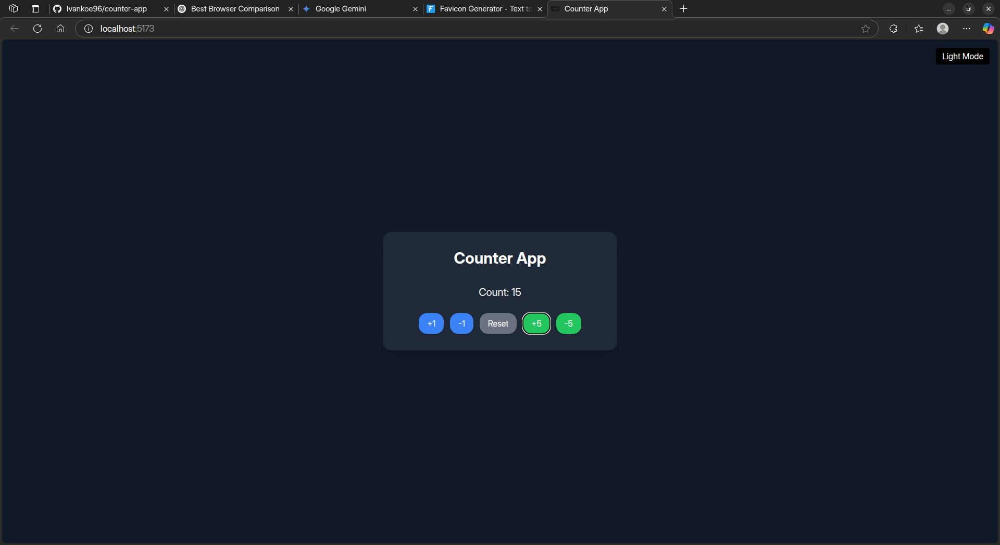
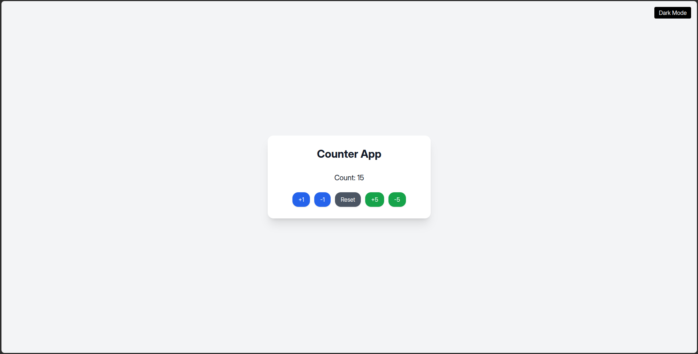

# My Awesome Counter App



A simple yet elegant counter application built with React, Vite, and Tailwind CSS. This app demonstrates basic state management, component modularization, custom hooks, and dark mode functionality.

## Features

* **Increment/Decrement Count:** Easily adjust the count by +1, -1, +5, or -5.
* **Reset Functionality:** Reset the count to zero at any time.
* **Persistent Dark Mode:** Toggles between light and dark themes, with preference saved locally.
* **Responsive Design:** Works well on various screen sizes.
* **Modular Codebase:** Leverages custom hooks (`useCounter`, `useDarkMode`) and component separation (`CounterControls`) for clean, reusable code.

## Technologies Used

* **React:** A JavaScript library for building user interfaces.
* **Vite:** A fast build tool that provides an excellent developer experience.
* **Tailwind CSS:** A utility-first CSS framework for rapidly building custom designs.
* **Framer Motion:** A library for production-ready motion and animation.
* **Vitest:** A blazing fast unit test framework powered by Vite.
* **React Testing Library:** Tools for testing React components and hooks.

## Getting Started

Follow these steps to get a local copy of the project up and running on your machine.

### Prerequisites

Make sure you have Node.js and npm (or yarn) installed.

* Node.js: [https://nodejs.org/](https://nodejs.org/)
* npm: (Comes with Node.js)
* Yarn (optional): `npm install -g yarn`

### Installation

1.  **Clone the repository:**
    ```bash
    git clone [https://github.com/Ivankoe96/counter-app.git](https://github.com/Ivankoe96/counter-app.git)
    ```

2.  **Navigate into the project directory:**
    ```bash
    cd counter-app
    ```

3.  **Install dependencies:**
    ```bash
    npm install
    # or
    yarn install
    ```

### Running the Application

To start the development server:

```bash
npm run dev
# or
yarn dev
```

The application will typically be available at http://localhost:5173/ (or another port if 5173 is in use).
